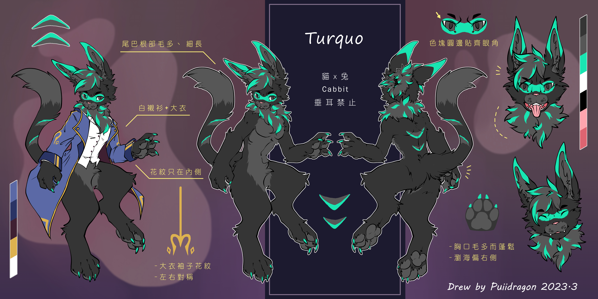
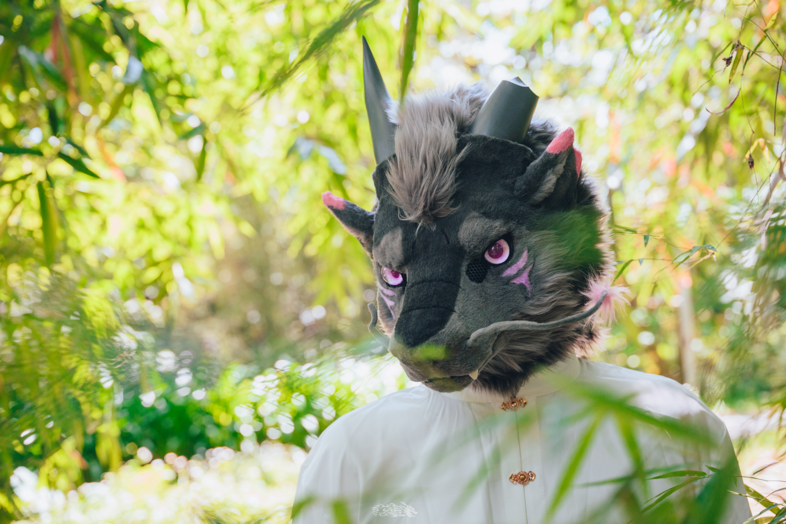

## 嗨嗨！我是韜光，很高興你想認識我！

[English version](./README_EN.md)

[~~如果排版炸裂了可以看看這裡~~](https://github.com/turquobitbit)

<figcaption>
<a href="https://slow.work/" target="_blank"> @Slow.work</a>
</figcaption>

 

* [Facebook](https://www.facebook.com/turquoCabbit) {中文}
* [X](https://twitter.com/Turquobitbit) {ENG}
* [BSKY](https://bsky.app/profile/turquocabbit.bsky.social) {ENG}
* [噗浪](https://www.plurk.com/night5916lan) {中文}
* [Twitch](https://www.twitch.tv/turquocabbit)
* [Flickr 相簿](https://www.flickr.com/photos/197896838@N03/albums/)
* [Discord](https://discordapp.com/users/401422083231449098)
* [Telegram](https://t.me/night5916lan)

---
* 涉略
    * 主要使用中文/英文，正在緩慢學習日文中 

    * 攝影
        * [Flickr 相簿](https://www.flickr.com/photos/197896838@N03/albums/)
        * 2023獸無限後掉進相機坑
            * ~~[Nikon Z6II](https://imaging.nikon.com/imaging/lineup/mirrorless/z_6_2/) (20231128)~~
            * [NIKKOR Z 24-120mm F4 S](https://imaging.nikon.com/imaging/lineup/lens/z-mount/z_24-120mmf4s/) (20231128)
            * ~~[NIKKOR Z 40mm F2 SE](https://imaging.nikon.com/imaging/lineup/lens/z-mount/z_40mmf2_se/)~~
            * ~~[NIKKOR Z 85mm F1.8 S](https://imaging.nikon.com/imaging/lineup/lens/z-mount/z_85mmf18s/)~~
            * ~~[NIKKOR Z 50mm F1.8 S](https://imaging.nikon.com/imaging/lineup/lens/z-mount/z_50mmf18s/) (20250818)~~
            * [Nikon Z6III](https://imaging.nikon.com/imaging/lineup/mirrorless/z6_3/) (20251016) 

    * 奇幻/科幻文學、武俠小說
        * 最喜歡的幾個系列
            * 颶光典籍(或者說整個[寰宇](https://www.brandonsanderson.com/)?)
            * 刺客系列
            * 獵魔士系列
            * 海柏利昂
            * 時光之輪
        * 也正嘗試創作自己的 

    * 身在耳機坑裡
        * 現役:
            * 耳機：
                1. [Dan Clark ÆON 2 Noire](https://danclarkaudio.com/aeon-2-noir.html)
                2. [HD6XX](https://drop.com/buy/massdrop-sennheiser-hd6xx)
                3. [UE 11Pro](https://pro.ultimateears.com/products/ue-11-pro)
            * 前端
                1. [ZEN DAC V2](https://ifi-audio.com/)
                2. [Topping A90](https://www.tpdz.net)

        * LOG：
            * 2017/07 [m-DAC mini](https://www.audiolab.co.uk/mdac-mini/) 推 [DT770 pro 250Ω](https://europe.beyerdynamic.com/dt-770-pro.html)
            * 2019/05 [Keces S3](https://www.kecesaudio.com/ch/S3.html) 推 [T1 2nd](https://global.beyerdynamic.com/t1.html)
            * 2020/08 訂做了[UE 11Pro](https://pro.ultimateears.com/products/ue-11-pro)
            * 2020/08 買了[Fiio BTR5](https://fiio.com/btr5)
            * 2020/12 買了一條[漢聲Aegis](http://www.hansoundaudio.com/Product_Detail.aspx?BigClassID=00000000-0000-0000-0000-000000000000&ClassID=50d0655e-c3f9-4304-92a7-e21418bd23ff&ID=81632ecf-ae85-4854-8ac0-5d2c11808df0)平衡線
            * 2021/04 買了[HD6XX](https://drop.com/buy/massdrop-sennheiser-hd6xx)
            * 2021/05 賣掉[Fiio BTR5](https://fiio.com/btr5) 換成[A&K Kann Alpha](https://www.astellnkern.com/product/product_detail.jsp?productNo=7)
            * 2022/01 買了[Dan Clark ÆON 2 Noire](https://danclarkaudio.com/aeon-2-noir.html)
            * 2022/01 買了[Topping A90](https://www.tpdz.net)
            * 2022/04 賣掉[A&K Kann Alpha](https://www.astellnkern.com/product/product_detail.jsp?productNo=7)
            * 2022/05 買了[SMSL SU-9](https://smsl-audio.com)
            * 2025/08 賣掉[SMSL SU-9](https://smsl-audio.com) 

    * 常聽的音樂
        * 古典:**協奏曲**到大編制 (2022開始大量聽古典樂)
        * 日搖，喜歡日式電吉他的聲音
        * 西洋老歌/搖滾(70's~90's)：超愛Journey, Queen, U2, 
        * 國台語老歌：特愛伍佰
        * 古風歌
        * 電影/遊戲原聲帶：就算沒看/玩過的也會聽
        * 史詩音樂 

    * 嗜喝咖啡
        * 磨豆機是[1Zpresso X-Pro](https://1zpresso.com/xpro/)，加上自己做了一個[電動套件](https://www.plurk.com/p/p73ac5)
        * 目前使用[V60 02](https://www.hario.com.tw/?product=v60%e9%80%8f%e6%98%8e02%e6%a8%b9%e8%84%82%e6%bf%be%e6%9d%af)沖
            * 淺焙、淺中焙
            * 粉水比1:17
            * 水溫86度C
        * 也玩[愛樂壓](https://aeropress.com/)
            * 我的配方:
                1. 中深焙豆16克，磨到接近espresso的細度
                2. 愛樂壓採用倒置法放入咖啡粉
                3. 熱水沖濕濾紙，開始計時
                4. 注入85度C熱水100克，攪拌均勻
                5. 蓋上蓋子壓出空氣，浸泡到100秒
                6. 翻過來擠出咖啡，加鮮奶180克飲用 

    * 電影 
        * 無論商業片冷門片，只要有興趣都看
        * 不看恐怖片，討厭jump scare 
    
    * 遊戲
        * [歐洲卡車模擬器2](https://store.steampowered.com/app/227300/Euro_Truck_Simulator_2/)
            * STEAM 好友代碼: 1738426172
        * [斯普拉頓3](https://www.nintendo.com/hk/switch/av5ja/index.html)
            * NS id: SW-8191-2745-2518
            

            
            
 

    * Indexing Investment
        * [Bogleheads Three-fund portfolio](https://www.bogleheads.org/wiki/Three-fund_portfolio) 

    * 喜愛meme 

    * 喜愛Dad jokes 

* 設定
    * 韜光 Turquo
        * [TG sticker pack](https://t.me/addstickers/turquo_cabbit)
        * 貓兔 Cabbit
        

        
        <figcaption>
        <a href="https://www.facebook.com/puiidrgonthevelociraptor" target="_blank"> 🎨妞龍</a>
        </figcaption>
        
 

        * 兔擠 bunny
        

        
        <figcaption>
        <a href="https://susey3377.wixsite.com/visionalbird" target="_blank"> 🎨無鳥</a>
        </figcaption>
        
 

    
    * 可瑪 Crema
        * [TG sticker pack](https://t.me/addstickers/cremac)
        * 邊境牧羊犬
        

        
        <figcaption>
        <a href="https://www.facebook.com/hu.mu.737173" target="_blank"> 🎨狐睦</a>
        </figcaption>
        
 

        

        
        <figcaption>
        <a href="https://x.com/eagle_wing0717" target="_blank"> 🪡Hungry Dog Fur</a>
        <a href="https://x.com/Dass_a_thickass" target="_blank"> 📷達斯</a>
        </figcaption>
        
 
        

    * [上官晦璃](https://www.facebook.com/profile.php?id=61584125551075)

            隔岸聽潮，盛月相邀，銀鏈懸飛雲山高。
            小爐燒，茗香繞。
            晦覆霞羽尾輕搖，璃韜不與鯤鱗較。
            平，莫憂騷；祿，莫憂騷。

        
        * ~~麵條~~龍
        

        
        <figcaption>
        <a href="https://www.facebook.com/mixdog018" target="_blank"> 🎨DOG</a>
        </figcaption>
        
 

        

        
        <figcaption>
        <a href="https://x.com/Qiuqiu1290" target="_blank"> 🪡秋秋</a>
        <a href="https://x.com/VinTheCoyote" target="_blank"> 📷凡凡</a>
        </figcaption>
        
 

---
* [Facebook](https://www.facebook.com/turquoCabbit) {中文}
* [X](https://twitter.com/Turquobitbit) {ENG}
* [BSKY](https://bsky.app/profile/turquocabbit.bsky.social) {ENG}
* [噗浪](https://www.plurk.com/night5916lan)
* [Twitch](https://www.twitch.tv/turquocabbit)
* [Flickr 相簿](https://www.flickr.com/photos/197896838@N03/albums/)
* [Discord](https://discordapp.com/users/401422083231449098)
* [Telegram](https://t.me/night5916lan)

